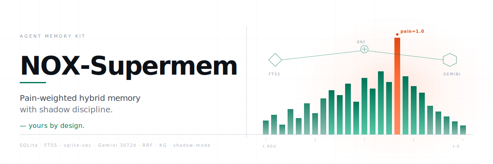
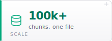
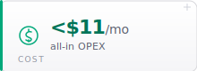
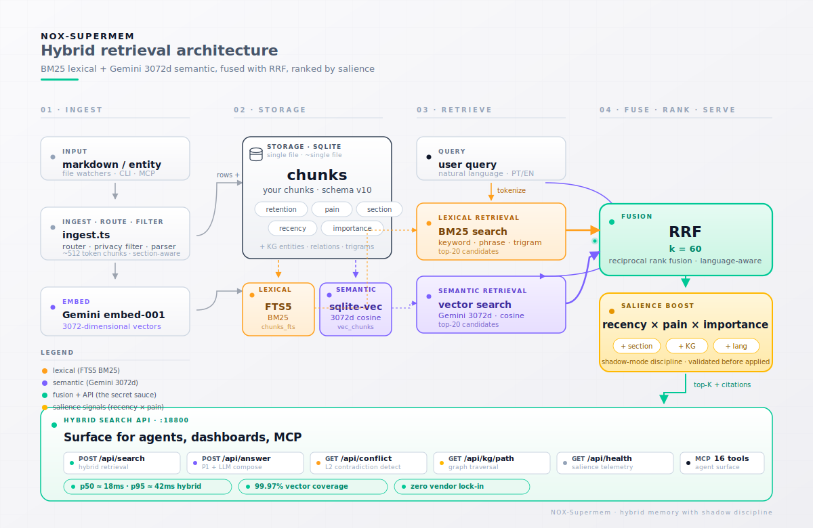
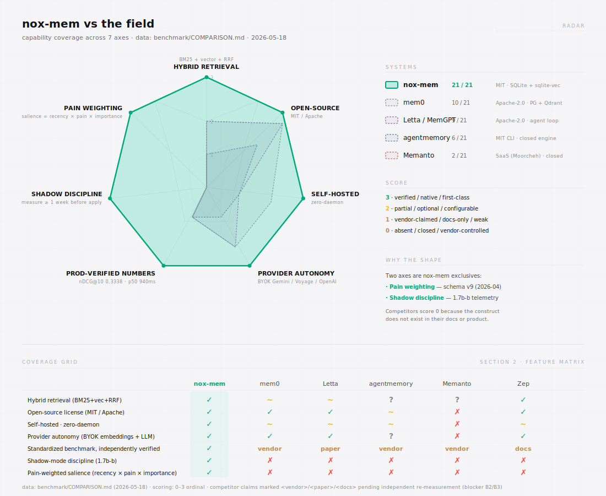

<p align="center">
  <picture>
    <source media="(prefers-color-scheme: dark)" srcset="assets/readme/banner-dark.svg">
    
  </picture>
</p>

<h1 align="center">Pain-weighted hybrid memory for AI agents &mdash; yours by design.</h1>

<p align="center"><em>The only agent memory that&rsquo;s genuinely yours. SQLite on your disk, provider your choice, zero vendor lock-in.</em></p>

<p align="center"><sub><strong>NOX-Supermem</strong> packages the <a href="https://github.com/totobusnello/memoria-nox"><code>nox-mem</code></a> engine for standalone, self-hosted use &mdash; CLI &middot; MCP server &middot; HTTP API.</sub></p>

<p align="center">
  
  
  
</p>

<p align="center">
  <a href="LICENSE.md"></a>
  <a href="https://github.com/totobusnello/nox-supermem/stargazers"></a>
  <a href="https://github.com/totobusnello/nox-supermem/actions/workflows/build.yml"></a>
  =20">
  
</p>

<p align="center">
  <picture><source media="(prefers-color-scheme: dark)" srcset="assets/readme/stat-locomo-dark.svg"></picture>
  <picture><source media="(prefers-color-scheme: dark)" srcset="assets/readme/stat-longmemeval-dark.svg"></picture>
  <picture><source media="(prefers-color-scheme: dark)" srcset="assets/readme/stat-latency-dark.svg"></picture>
  <br>
  <picture><source media="(prefers-color-scheme: dark)" srcset="assets/readme/stat-scale-dark.svg"></picture>
  <picture><source media="(prefers-color-scheme: dark)" srcset="assets/readme/stat-opex-dark.svg"></picture>
  <picture><source media="(prefers-color-scheme: dark)" srcset="assets/readme/stat-tests-dark.svg"></picture>
</p>

<p align="center">
  <a href="#%EF%B8%8F-how-it-works">🏗️ How it works</a> &middot;
  <a href="#-install">🚀 Install</a> &middot;
  <a href="#-step-by-step--for-humans">👤 Humans</a> &middot;
  <a href="#-step-by-step--for-agents-openclaw--hermes--others">🤖 Agents</a> &middot;
  <a href="#-the-numbers">📊 Numbers</a>
</p>

Long-term memory engine that any agent (OpenClaw, Hermes, Claude Code, custom) can use to *remember decisions, search past context, and never ask "where were we?" again.* The engine lives in [`nox-mem/`](./nox-mem) and ships with **no data** — your memory starts empty.

---

## 🏗️ How it works

<p align="center">
  <picture>
    <source media="(prefers-color-scheme: dark)" srcset="assets/readme/architecture-dark.svg">
    
  </picture>
</p>

**Five layers, one SQLite file:**

1. **Ingest** — router auto-detects entity files (`compiled` / `frontmatter` / `timeline` sections), plain markdown, or graphify input. A privacy filter applies redaction patterns before anything is stored.
2. **Store** — chunks land in SQLite with an FTS5 index plus a 3072-d Gemini vector via `sqlite-vec`. Retention is typed: `feedback`/`person` never decay, `lesson` 180d, `decision`/`project` 365d, default 90d.
3. **Retrieve** — the query runs in parallel through FTS5 BM25 and Gemini semantic; **RRF fusion (k=60)** merges them, with language-aware weights.
4. **Rank** — **salience** (`recency × pain × importance`) composes additively with section and temporal boosts. *Shadow discipline:* ranking changes ship in shadow mode for 7 days before they ever touch a live query.
5. **Answer** — CLI, MCP, and HTTP surfaces with citation footers and an anti-hallucination guard.

Copy the SQLite file, you copy the memory. Switch the embedding provider, the store doesn't care.

---

## 🚀 Install

Pick your interface — same engine, one SQLite file behind all three:

| Interface | Entry point | Best for |
|---|---|---|
| **CLI** | `nox-mem <cmd>` | humans, scripts, cron |
| **MCP server** | `node nox-mem/dist/mcp-server.js` | **agents** (OpenClaw, Hermes, Claude Code) — 20 tools |
| **HTTP API** | `node nox-mem/dist/api-server.js` | services, dashboards, remote agents |

**Prerequisites (Linux / macOS):** Node 20+, plus `build-essential` and `python3` (compile the native `better-sqlite3` / `sqlite-vec` modules).

```bash
# Debian/Ubuntu
sudo apt-get update && sudo apt-get install -y build-essential python3 inotify-tools
node --version   # must be >= 20
```

### ⚡ Quick install (copy-paste)

```bash
git clone https://github.com/totobusnello/nox-supermem.git
cd nox-supermem/nox-mem
npm ci && npm run build && npm install -g .      # or: bash ../install.sh  (--dry-run to preview)

export GEMINI_API_KEY=AIza...                    # https://aistudio.google.com/apikey
export NOX_DB_PATH="$HOME/.nox-mem/nox.db"
export NOX_MEM_DIR="$HOME/.nox-mem/memory"
mkdir -p "$HOME/.nox-mem/memory"

nox-mem stats && nox-mem search "hello"
```

### 👤 Step by step — for humans

**1. Clone, build, install globally**

```bash
git clone https://github.com/totobusnello/nox-supermem.git
cd nox-supermem/nox-mem
npm ci
npm run build              # tsc → dist/
npm install -g .           # exposes `nox-mem` globally
nox-mem --help
```

**2. Configure** — create a `.env` (template in [`nox-mem/.env.example`](./nox-mem/.env.example)):

```bash
# Required
GEMINI_API_KEY=AIza...                 # Google AI Studio key
NOX_DB_PATH=/root/.nox-mem/nox.db      # SQLite database (any path you can write)
NOX_MEM_DIR=/root/.nox-mem/memory      # folder of markdown memories

# HTTP API (optional) — code default port is 18800; 18802 recommended to avoid clashes
NOX_API_PORT=18802
NOX_API_HOST=127.0.0.1
# NOX_API_TOKEN=change-me              # if set, API requires Authorization: Bearer <token>
```

Load it before running the CLI in any shell, cron, or service:

```bash
set -a; source /root/.nox-mem/.env; set +a
```

> ⚠️ Without sourcing the env, `vectorize`/`kg-*` fail **silently** ("Done: 0 embedded").

**3. Initialize & verify**

```bash
nox-mem stats     # first run creates the v10 schema (11 tables) automatically — no migrations to run
nox-mem doctor    # diagnostic: SQLite, FTS5, vector extension, config
```

**4. Ingest, embed, search**

```bash
nox-mem ingest /path/to/notes.md     # plain markdown is fine
nox-mem vectorize                    # embeds new chunks (needs GEMINI_API_KEY)
nox-mem search "what did we decide about pricing"
nox-mem primer                       # ~500-token context-recovery summary
```

### 🤖 Step by step — for agents (OpenClaw / Hermes / others)

Agents connect over **MCP** (preferred) or the **HTTP API**. The bootstrap is idempotent — each step verifies before continuing.

**1. Deterministic bootstrap** (run in order; stop on first failure)

```bash
# preconditions
node --version | grep -qE 'v(2[0-9]|[3-9][0-9])' || { echo "need Node >=20"; exit 1; }

# clone + build + install
git clone https://github.com/totobusnello/nox-supermem.git
cd nox-supermem/nox-mem && npm ci && npm run build && npm install -g .

# config
export GEMINI_API_KEY="<key>" NOX_DB_PATH="/data/nox/nox.db" NOX_MEM_DIR="/data/nox/memory"
mkdir -p "$NOX_MEM_DIR"

# verify schema
nox-mem stats | grep -q "Chunks:" || { echo "schema init failed"; exit 1; }
```

**2. Wire it as an MCP server** (recommended) — 20 tools (`nox_mem_search`, `nox_mem_ingest`, `nox_mem_primer`, `nox_mem_reflect`, `nox_mem_kg_query`, `nox_mem_decision_*`, `nox_mem_cross_search`, …). Add to your agent's MCP config (Claude Code `.mcp.json`, OpenClaw/Hermes equivalent):

```json
{
  "mcpServers": {
    "nox-mem": {
      "command": "node",
      "args": ["/abs/path/to/nox-supermem/nox-mem/dist/mcp-server.js"],
      "env": {
        "GEMINI_API_KEY": "AIza...",
        "NOX_DB_PATH": "/data/nox/nox.db",
        "NOX_MEM_DIR": "/data/nox/memory"
      }
    }
  }
}
```

The agent calls `nox_mem_search` to recall and `nox_mem_ingest` to store. Run `nox_mem_primer` at session start for context recovery. Reusable agent profiles (`assistente-pessoal`, `financeiro`, `pesquisador`) live in [`perfis/`](./perfis); generic SOUL/HEARTBEAT/IDENTITY templates in [`templates/`](./templates).

**3. Or wire it as an HTTP API**

```bash
set -a; source /data/nox/.env; set +a
node "$(npm root -g)/nox-mem/dist/api-server.js"      # or: node nox-mem/dist/api-server.js from the repo
```

| Endpoint | Purpose |
|---|---|
| `GET /api/health` | status + `vectorCoverage` (embedded vs total) |
| `GET /api/search?q=...` | hybrid search |
| `GET /api/brief` | salience-ranked session priming |
| `POST /api/answer` | RAG answer over memory |
| `GET /api/kg`, `/api/kg/path` | knowledge graph |
| `GET /api/reflect` | high-salience insights |

If `NOX_API_TOKEN` is set, send `Authorization: Bearer <token>`.

---

## 📊 The numbers

The engine is the same core benchmarked in [`memoria-nox`](https://github.com/totobusnello/memoria-nox). All results 5-batch + 95% CI verified.

<p align="center">
  <picture>
    <source media="(prefers-color-scheme: dark)" srcset="assets/readme/comparison-chart-dark.svg">
    
  </picture>
</p>

### Memory & multi-hop SOTA

| Benchmark | nox-mem | Best competitor | Δ |
|---|---:|---|---:|
| **EverMemBench Overall** (Gemini-3-flash) | **63.28%** | MemOS 42.55% | **+20.73pp** |
| **EverMemBench MA composite** | **88.42%** | MemOS 55.68% | **+32.74pp** |
| **LoCoMo retrieval@10 strict** | **74.52%** | Mem0 SOTA F1 66.88% | above |
| **MuSiQue F1** (n=2,417, single-shot) | **58.62%** | IRCoT 35.80% / EX(SA) 49.70% | **+22.82pp / +8.92pp** |
| **HotPotQA ans_F1** (n=7,405 distractor) | **73.37%** | DPR+FiD reader 65–72% | **above band** |

### Production characteristics

| Dimension | nox-mem | Comparison |
|---|---:|---|
| **KG path latency** | **2.5ms p50** | none sub-10ms published |
| **KG path cost/query** | **$0.00** | Mem0 Cloud $0.001 → **769× cheaper** |
| **Self-hosted footprint** | **399MB single-process** | Zep/Mem0/MemOS run 4+ services |
| **Backbone portability** | **−10.54pp on backbone swap** | MemOS −16.72pp → **1.6× more portable** |
| **Monthly OPEX** (embed + KG + VPS) | **< $11/mo** all-in | — |

<sub>Methodology, paper, and full competitive analysis: [`memoria-nox`](https://github.com/totobusnello/memoria-nox). MemOS arXiv:2602.01313 · MuSiQue (Trivedi 2022) · HotPotQA (Yang 2018).</sub>

---

## 🔌 Multi-provider

Default is **Gemini via Google AI Studio**. Point the LLM/embeddings at any **OpenAI-compatible** endpoint (DeepSeek, OpenRouter, Together, local Ollama/vLLM):

```bash
# LLM
NOX_LLM_PROVIDER=openai
NOX_LLM_BASE_URL=https://api.deepseek.com/v1     # or openrouter.ai/api/v1, api.together.xyz/v1, http://127.0.0.1:11434/v1
NOX_LLM_MODEL=deepseek-chat
NOX_LLM_API_KEY=sk-...

# Embeddings (keep one model/dim for the whole corpus)
NOX_EMBEDDING_PROVIDER=openai
NOX_EMBEDDING_BASE_URL=https://api.openai.com/v1
NOX_EMBEDDING_MODEL=text-embedding-3-large
NOX_EMBEDDING_DIM=3072        # MUST equal the vec0 table dim; changing model/dim requires re-embedding
NOX_EMBEDDING_API_KEY=sk-...
```

> ⚠️ Embeddings from different models/dimensions are not comparable. Pick one up front — mixing silently corrupts semantic search. Full env reference: [`nox-mem/README.md`](./nox-mem/README.md).

---

## 🩺 Verify & troubleshoot

```bash
node "$(npm root -g)/nox-mem/dist/api-server.js" &
curl -s "http://127.0.0.1:${NOX_API_PORT:-18800}/api/health" | jq .vectorCoverage
# close to 1.0 = all chunks embedded; below 0.99 → run `nox-mem vectorize`
```

| Symptom | Fix |
|---|---|
| `vectorize` says "0 embedded" | env not sourced — `set -a; source .env; set +a` |
| `vec0 ... cannot open shared object` | platform binary missing — `npm i -g sqlite-vec` or reinstall on the target OS |
| `better-sqlite3` build error | install `build-essential` + `python3`, then `npm ci` again |
| API port in use | set `NOX_API_PORT` (code default is 18800) |
| path rejected by op-audit guard | set `NOX_OP_AUDIT_ALLOWED_PREFIXES`, or keep DB under `NOX_DB_PATH`/`NOX_MEM_DIR` (auto-allowed) |

Full env-var reference and per-command notes: **[`nox-mem/README.md`](./nox-mem/README.md)**.

---

## License

MIT © 2026 Luiz Antonio Busnello (Toto). Use it, fork it, ship it.
